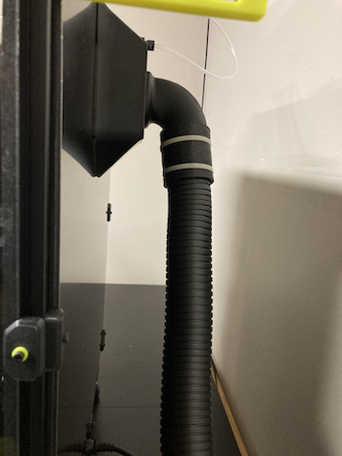

# BOFA PrintPro2 Exhaust Housing

I have a BOFA PrintPro2, which I purchased from [Printed Solid](https://www.printedsolid.com/products/bofa-3d-print-pro-2-fume-extraction).  In order to attach it to my Voron 2.4 I needed to print some parts via STLs provided by Printed Solid, then modify the core (improved (Trident)) exhaust housing and filter cover to accomodate them.  Here is the list...

| BOFA PrintPro2 + Voron 2.4 | |
| :--- | :--- |
| [`Printed_Solid_BOFA_enclosure_hose_mount.zip`](Printed_Solid_BOFA_enclosure_hose_mount.zip) | This zipfile contains the 90 degree tube connector and the nut that holds it in place.  It is the same zipfile from the [Printed Solid website](https://www.printedsolid.com/collections/bofa-air-filters), duplicated here for easy access. |
| [`filter_access_cover.stl`](filter_access_cover.stl) | The core Trident filter access cover with a hole in it for the Printed Solid tube.  Also made thicker to handle the weight of the hose and higher to accomodate the size of the nut. |
| [`exhaust_filter_housing.stl`](exhaust_filter_housing.stl) | The core Trident exhaust filter housing, fit to the resized filter access cover and with the hole for the fan removed |
| [`tpu_hose_coupling.stl`](tpu_hose_coupling.stl) | I was pretty disappointed to find that the Printed Solid connector didn't fit in the BOFA hose.  It was too late in the day to head to the hardware store, so I made this connector and printed it from TPU.  This is the exact design I printed, but honestly if I had more time I'd adjust it a bit, as it probably needs to be about 1mm smaller in inner diameter.  ymmv.|
| [`bowden_coupling.stl`](bowden_coupling.stl) | Not a requirement, but every time I removed the bowden tube I got irked that the coupling only went one way so I made a drop-in replacement. |

Printed Solid has a [good blog post](https://www.printedsolid.com/blogs/news/why-you-won-t-find-a-hepa-filter-hanging-on-the-back-of-our-enclosures) on filters and 3d printers that's worth a read.

Here's what it looks like put together:

