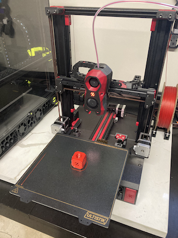
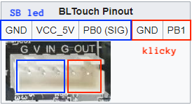
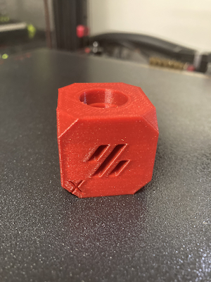
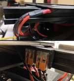
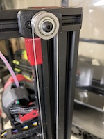
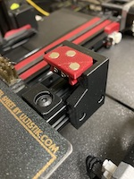
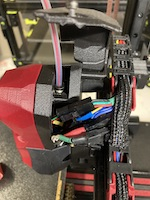
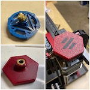
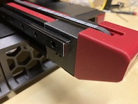

# ernie, the steathbowden enderwire

*an e3v2 switchwire conversion...*

### why?

this is a Voron Switchwire build for an Ender 3 v2, based on the popular [DaRk_dOg](https://github.com/boubounokefalos/Ender_SW) Switchwire mod.

the [DaRk_dOg](https://github.com/boubounokefalos/Ender_SW) mod is really fantastic, and deserves a ton of credit.  it does have some limitations, howeer, namely that I wanted auto z, which required a homing switch and klicky probe to be fit in somewhere.  

other than auto z, my other goal was to use as many of the original e3v2 parts as I could, in order to keep conversion costs as low as possible.

the result is `ernie` - a bowden-based stealthburner switchwire using the original e3v2 extruder, creality 4.2.2 board, and whatever other parts I could salvage.

I'll add some more details as I think of them...

### BOM

major BOM changes from the official [Voron Switchwire](https://vorondesign.com/voron_switchwire) and/or [DaRk_dOg](https://github.com/boubounokefalos/Ender_SW/wiki/Custom-Bom) BOM are:

| | | |
| :--- | :--- | :--- |
| **350mm rails** | 2 | provide room for the homing switch and klicky dock, and replace the dual 300mm Y rails in the DaRk_dOg mod |
| **250mm 2020 extrusions** | 2 | for use as both a bed mount and where the homing switch and klicky mount sit |
| **m4 flat head screws and extrusion nuts** | 4 | to mount the bed on the extrusion.  you can probably use m3 flat heads if you have them. |
| **aliexpress [door puller](https://www.aliexpress.com/item/2255801159810332.html)** | 1 | $3 alternative to the $20 keybak from the sourcing guide, recommended on discord |
| **m5 tap** | 1 | this isn't specific to my mod - most of my stock e3v2 4040 frame was *not* tapped, so the screws for the DaRk_dOg grills had no place to go.  you'll be very happy you have this when the time comes. |

I didn't keep track of all the screws and fasteners I used, since I had an abundance sitting around, but there was nothing unique required other than the m4 screws and nuts, which I don't think are part of other standard Voron BOMs.

all the rest is from my stripped down ender...

### changes, mods, etc

there are a few categories of changes:

- alterations required where fit for my october 2020 e3v2 was a bit different than the DaRk_dOg model
- new parts needed for klicky auto z calibration
- bowden mod for stealthburner

#### replacement parts
| | |
| :--- | :--- |
| [`[a]_xz_cable_cover.stl`](stl/replacements/[a]_xz_cable_cover.stl)| a shorter cable cover so the fit against the z block is tight |
| [`[a]_y_axis_ls_mount.stl`](stl/replacements/[a]_y_axis_ls_mount.stl)| stubby y endstop mount to fit behind the 350mm rail |
| [`cover_4040_extrusion_cut_enderV2.stl`](stl/replacements/cover_4040_extrusion_cut_enderV2.stl)| the factory cutout in my frame for the electronics cable was extra large it seems |
| [`grill_rear_middle.stl`](stl/replacements/grill_rear_middle.stl)| modified to fit the factory power inlet and switch |
| [`grill_rear_right.stl`](stl/replacements/grill_rear_right.stl)| put some heatsets in the 6020 fan and use m3 screws from behind to hold it in place |
| [`keybak_gantry_anchor.stl`](stl/replacements/keybak_gantry_anchor.stl)| specific to the aliexpress door pull |
| [`keybak_idler_bracket.stl`](stl/replacements/keybak_idler_bracket.stl)| repurpose bearings, screw, and heatset from one of the ender tensioners.  there are some m4 washers you can use on the outside, but standard m5 shims work well. |
| [`keybak_mount.stl`](stl/replacements/keybak_mount.stl)| specific to the aliexpress door pull |

#### new parts
| | |
| :--- | :--- |
| [`amplifier-foot-mount.stl`](stl/new/amplifier-foot-mount.stl)| mount for standard v2.4r2/trident amplifier feet |
| [`brush-mount.stl`](stl/new/brush-mount.stl)| if you want a brush |
| [`extruder-knob.stl`](stl/new/extruder-knob.stl)| repurpose the large heatset from the stock extruder knob for this.  can be printed in 2 colors following the v0 miniburner process outlined [here](https://imgur.com/a/FDyniIr) |
| [`klicky-mount.stl`](stl/new/klicky-mount.stl)| for auto z |
| [`m4-standoff-2mm.stl`](stl/new/m4-standoff-2mm.stl)| heat and height buffer between the bed and extrusions |
| [`nozzle_probe.stl`](https://github.com/VoronDesign/Voron-2/blob/Voron2.4/STLs/Z_Endstop/nozzle_probe.stl)| use the V2.4 standard z nozzle probe assembly |
| [`stealthbowden-body.stl`](stl/new/stealthbowden-body.stl) | go stealthbowden... |
| [`stealthbowden-plate.stl`](stl/new/stealthbowden-plate.stl)| ... and reuse the ender extruder  |
| [`tl-filament-sensor-bracket.stl`](stl/new/tl-filament-sensor-bracket.stl)| trianglelabs filament runout bracket |
| [`wago-bed-mount.stl`](stl/new/wago-bed-mount.stl)| holds two wago 221-413 lever-nuts for the bed heater wires |
| [`xy_chain_end-inner.stl`](stl/new/xy_chain_end-inner.stl) | 2 hole chain end for the x axis extrusion mount point.  lets you print some bling, plus if you use it you know your chain is facing the right direction :) |
| [`y-axis-350mm-extension.stl`](stl/new/y-axis-350mm-extension.stl)| add-on to the 4040 y frame to give room for the 350mm rails (I think I used M5x40 screws) |
| [`y-bed-chain-extension-generic.stl`](stl/new/y-bed-chain-extension-generic.stl)| the longer y movement needs longer bed chains.  you can either use this extension, or take 3 links from the x chain (since it's too long anyway) |
| [`y-endstop-bed-extension.stl`](stl/new/y-endstop-bed-extension.stl)| needed to hit the new y endstop position |

### wiring

the wiring for the creality 4.2.2 board is well documented, but I'll eventually post my klipper config.

as for the stealthburner led and klicky wiring, both can be serviced by the bltouch port:

### pictures

first print off the block - no input shaper, pressure advance, etc.  not perfect, but not bad :)

some others for reference...

| | | |
| :--- | :--- | :--- |
|  |  |  |
|  |  |  |
|  |  | 
