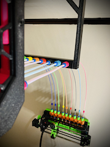
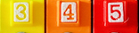

# ercf stuff...

|                               |                                                                                 |
| :---                          | :---                                                                            |
| buffer array                  |                         |
| magnet bridge                 |    |
| 90 degree extender            |                 |
| upside-down tag plates        |   |
| french cleat mount            | [here](./mounts/ercf-french-cleat/)       |
| sb lgx mount with filament sensor (no longer required with sensorless ercf) | [stl here](../stealthburner/stl/lgx/beta/cw2/sb-lgx-cw2-ercf-v5.stl) |

