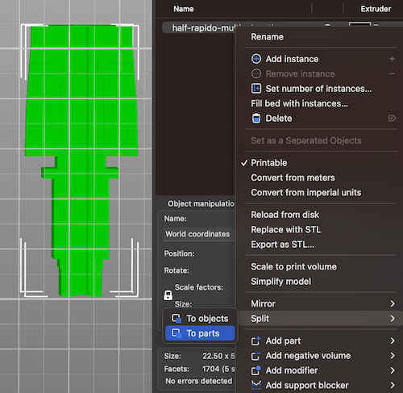

## half hotend models...

useful models for helping tip tuning

- half dragon: [half-dragon-multicolor.stl](half-dragon-multicolor.stl)
- half rapido: [half-rapido-multicolor.stl](half-dragon-multicolor.stl)

if I ever use a different hotend I'll whip one of those up, too.  for now, this is all (so please don't ask :)

see this discord post for a video of the model in action:

https://discord.com/channels/460117602945990666/909743915475816458/1069831340851200122

## howto

use split to parts... in superslicer, at least

